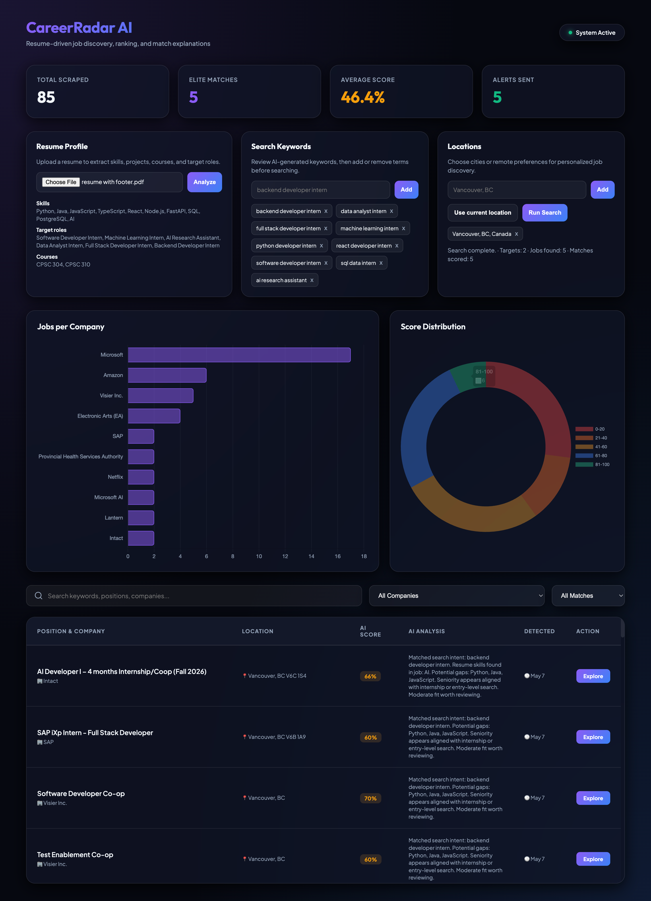

# CareerRadar AI

[](https://www.python.org/downloads/release/python-3110/)
[](https://github.com/budengjun/web-scraper/actions/workflows/tests.yml)
[](https://playwright.dev/)
[](https://scikit-learn.org/)
[](https://opensource.org/licenses/MIT)

An AI-powered job discovery platform that converts a resume into personalized search keywords, searches selected job sources by location and preference, and ranks postings based on resume-job fit.



---

## ✨ Features

- **Resume-driven discovery**: Upload PDF, DOCX, or TXT resumes and extract skills, courses, projects, experience, target roles, and search keywords.
- **Editable keyword profile**: Review generated keywords, add custom terms, disable or remove poor matches, and keep priorities in SQLite.
- **Location preferences**: Add preferred cities, remote locations, browser geolocation, work mode, and search radius metadata.
- **Browser automation pipeline**: Search LinkedIn and Indeed with Playwright using selected keywords and locations.
- **Resume-job matching**: Rank jobs with rule-based resume fit, matched skills, missing skills, seniority checks, and concise explanations.
- **Dashboard and notifications**: View matched postings, apply links, dashboard stats, and Discord notifications.

---

## 🗂️ Project Architecture

```
web-scraper/
├── main.py                    # Pipeline orchestrator: scrape → filter → score → notify
├── scraper.py                 # Playwright browser automation and API/DOM parsing
├── ml_scorer.py               # Local ML scoring (Sentence-Transformers + MLP)
├── resume_parser.py           # Resume text extraction and structured profile generation
├── profile_store.py           # SQLite storage for resumes, keywords, locations, matches
├── matching_engine.py         # Resume-job match scoring and explanation
├── notifier.py                # Discord webhook alerts
├── storage.py                 # SQLite persistence & deduplication
├── dashboard.py               # Flask web dashboard (http://localhost:5050)
├── models.py                  # Pydantic Job data model
├── config.example.yaml        # Safe template for local config.yaml
├── requirements.txt           # Project dependencies
├── static/                    # Dashboard frontend (HTML/CSS/JS)
└── tests/                     # Unit tests
```

---

## 🚀 Quick Start

### 1. Install Dependencies
```bash
conda create -n web-scraper python=3.11 -y
conda activate web-scraper
pip install -r requirements.txt
playwright install chromium
```

### 2. Configure Settings
Create a private `config.yaml` from the checked-in template, then set your Discord webhook and search preferences:
```bash
cp config.example.yaml config.yaml
```

Never commit `config.yaml`. Use `config.example.yaml` as the template and store API keys in environment variables such as `GEMINI_API_KEY` and `WEBHOOK_URL` when possible.

```yaml
settings:
  notification_webhook_url: "YOUR_DISCORD_WEBHOOK_URL"

targets:
  - name: "LinkedIn"
    url: "https://www.linkedin.com/jobs/search/"
    type: "linkedin"
    location: "Vancouver, BC, Canada"
    search_queries: ["Software Engineer Intern", "Machine Learning Co-op"]
```

### 3. Run the System
```bash
# Start the scraper
python main.py

# Launch the dashboard
python dashboard.py
# View at http://localhost:5050
```

### 4. Personalized Discovery Flow

1. Upload a resume in the dashboard.
2. Review extracted skills, target roles, and generated keywords.
3. Add preferred locations or use browser geolocation.
4. Run personalized search.
5. Review ranked jobs with matched skills, missing skills, and fit explanations.

---

## 🤖 AI Scoring System

Resume parsing uses a deterministic parser by default and can optionally call Gemini for JSON schema extraction when `GEMINI_API_KEY` is configured. If the LLM call fails or no key is available, the system falls back to the rule-based parser.

The local scoring system ranks jobs with explainable resume-job fit signals:

| Component | Technology | Description |
|---|---|---|
| **Resume Parser** | Rule-based + optional Gemini JSON extraction | Extracts skills, courses, projects, experience, target roles, and search keywords. |
| **Embedder** | `all-MiniLM-L6-v2` | CPU-friendly transformer (~80MB) that converts job descriptions into 384-dim vectors. |
| **Classifier** | `MLPClassifier` | Multi-layer Perceptron trained on your historical data to predict job relevance. |
| **Rule Matching** | Local Python scoring | Scores matched skills, missing skills, keyword fit, location preference, and seniority alignment. |
| **Backoff** | `Cosine Similarity` | Fallback mechanism that scores jobs based on keyword similarity if no training data is present. |
| **Training** | `Auto-Labeling` | `generate_training_data.py` bootstraps your model by labeling your existing jobs database. |

To retrain the model after gathering more data:
```bash
python generate_training_data.py
python -c "from ml_scorer import MLScorer; MLScorer().train()"
```

---

## Responsible Data Collection

The project uses browser automation for dynamic job pages and keeps collection rate-limited. Prefer public career pages, Greenhouse, Lever, Workday, and sources with stable public listings for portfolio demonstrations.

---

## ⚙️ Automated Deployment

Schedule the scraper to run for free using **GitHub Actions**:

```yaml
# .github/workflows/scrape.yml
name: Daily Job Scraper
on:
  schedule:
    - cron: '0 16 * * *'  # 9:00 AM PST
  workflow_dispatch:

jobs:
  scrape:
    runs-on: ubuntu-latest
    steps:
      - uses: actions/checkout@v4
      - uses: actions/setup-python@v5
        with: { python-version: '3.11' }
      - name: Install
        run: |
          pip install -r requirements.txt
          playwright install chromium
      - name: Scrape
        env: { WEBHOOK_URL: ${{ secrets.WEBHOOK_URL }} }
        run: python main.py
```

---

## 🧪 Development

Tested locally with Python 3.11; 37 unit tests passing.

```bash
# Run tests
python -m pytest tests/ -v

# Inspect database
sqlite3 jobs.db "SELECT title, company, match_score FROM jobs WHERE match_score > 80;"

# Fix relative links
python fix_links.py
```

---

## 📝 License
Distributed under the MIT License. See `LICENSE` for more information.
